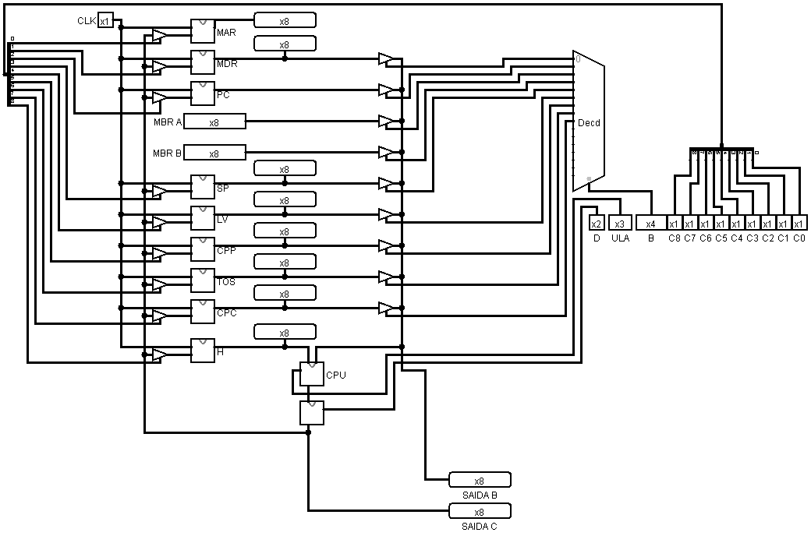
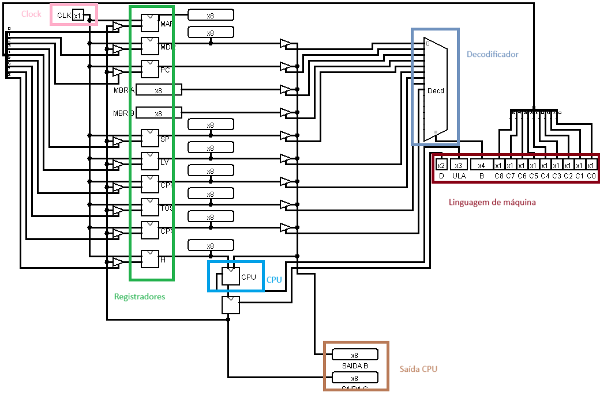

# Circuitos microarquitetura de computadores

Projeto de [microarquitetura](https://en.wikipedia.org/wiki/Microarchitecture) de computadores com CPU de 8bits.

Desenho geral da arquitetura:

# Componentes:

- CPU de 8bits com 

# Requerimentos
- [logisim](https://sourceforge.net/projects/circuit/files/2.7.x/2.7.1/logisim-generic-2.7.1.jar/download)
- Java > 5

# Executar o projeto local

`java -jar logisim-generic-2.7.1.jar`

