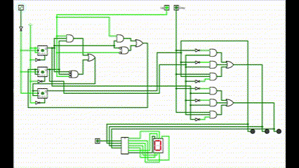
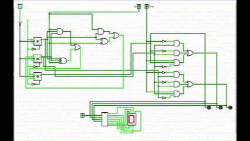
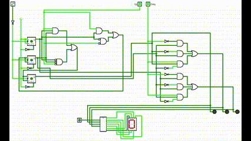
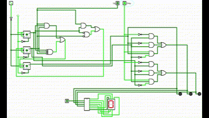

# Contador octal

Contador simples com funções UP e Down e contador em código grey (muda apenas 1 bit por vez).

1. Contador normal progressivo 0 à 7.
    

1. Contador normal regressivo 7 à 0.
    

1. Contador normal progressivo em código gray 0 à 7.

1. Contador normal regressivo em código gray 7 à 0.

