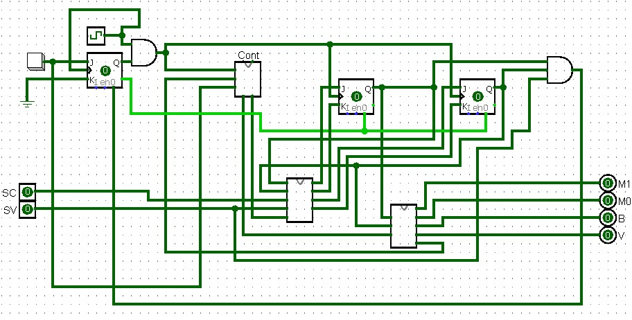
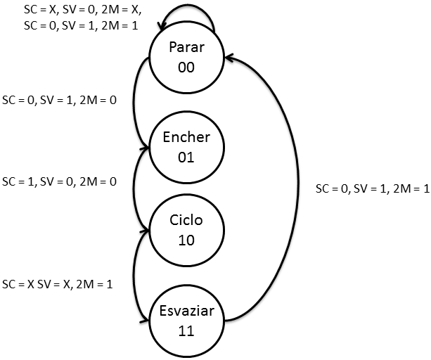
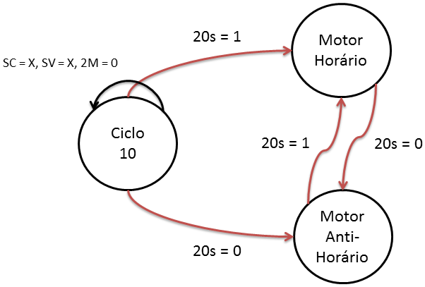
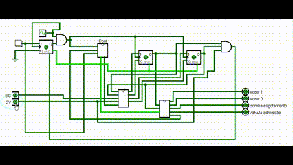

# Maquina de lavar

Projeto de maquina de lavar.

## Visão geral do circuito:

- BTN ligar/resetar
- SC (Sensor tanque cheio)
- SV (Sensor tanque vazio)
- M(0 e 1): Motores M1 ligado: sentido horario, M2 ligado: sentido anti-horario.
- B: Bomba de esgotamento.
- Válvula de admissão.

## Funcionamento

Máquina de estados do projeto:

Comandos de cada botão.

1. Máquina inicia no estado parado.
1. Botão iniciar é acionado.
1. `Sensor Vazio` acionado então máquina começa a encher. `Valvula de adimissão` acionada.
1. Quando o `Sensor Cheio` (SC) for acionado, o tanque terminou de encher.
1. Começa ciclo de lavagem, motores (`M0` e `M1`) mudam de direção a cada 20s.
1. Depois de 2min os motores param e inicia o esvaziamento do tanque. `Bomba de esgotamento` acionada até o `SV` (Sensor Vazio) indicar que terminou.
1. Máquina volta para o estado parado.

