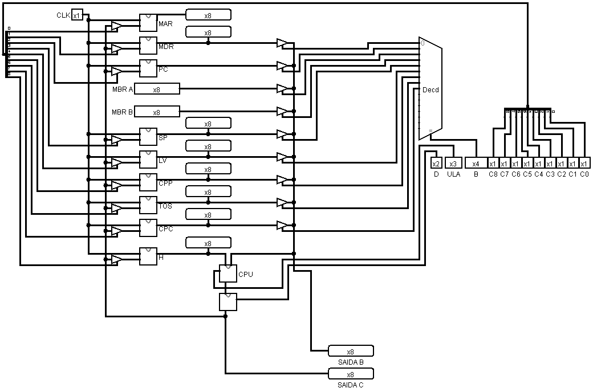
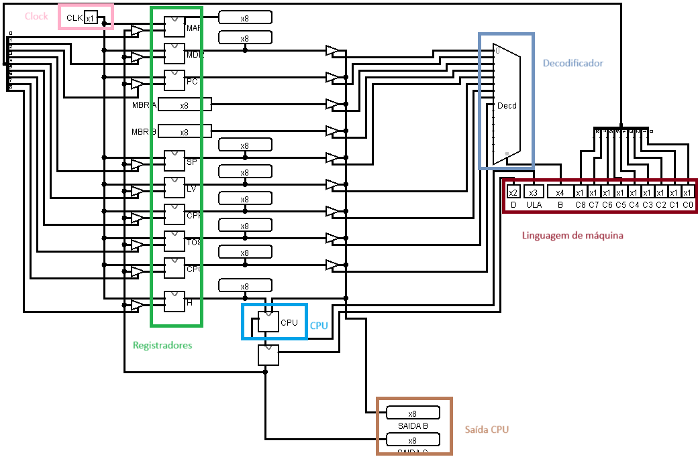
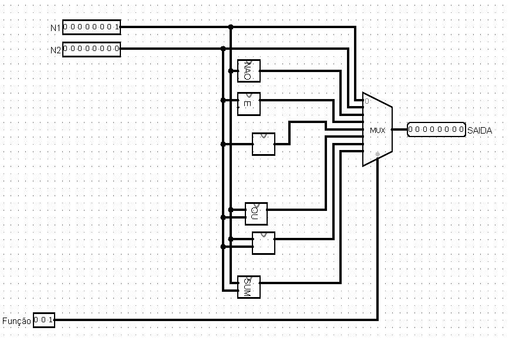
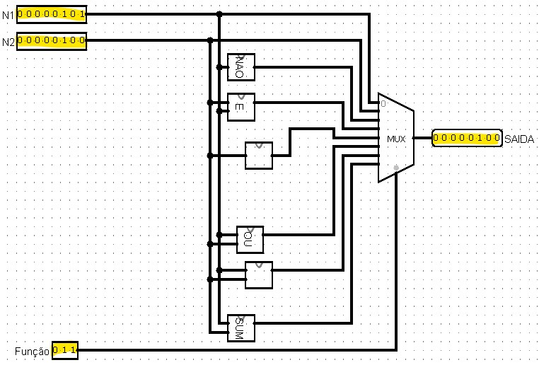
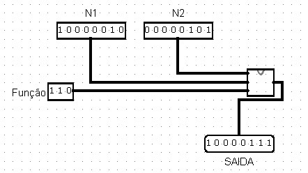
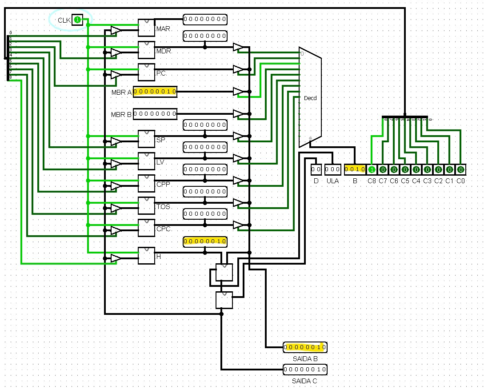
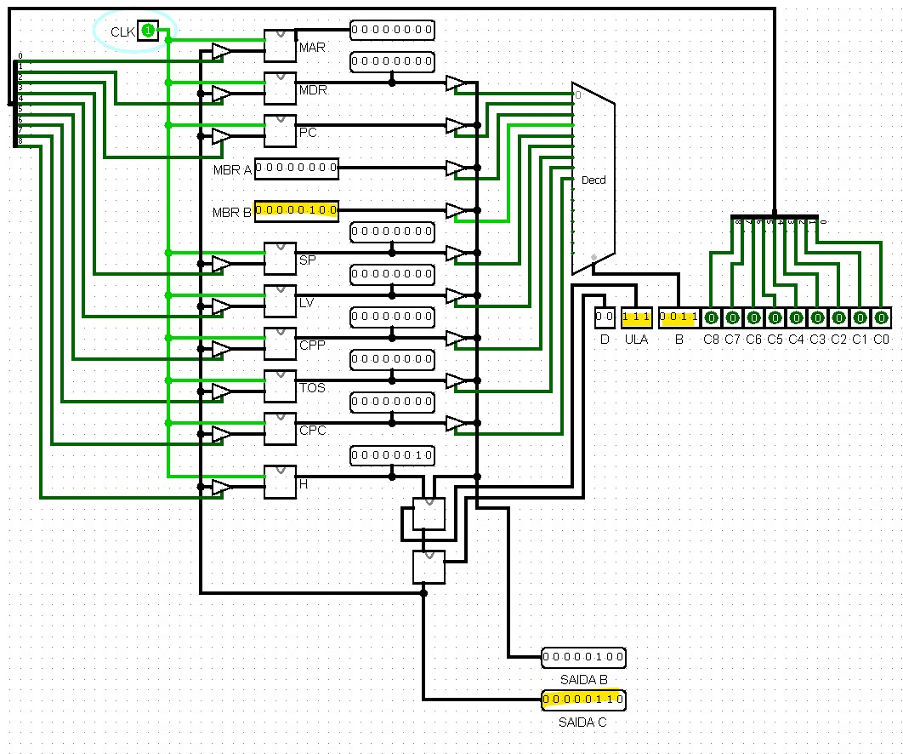
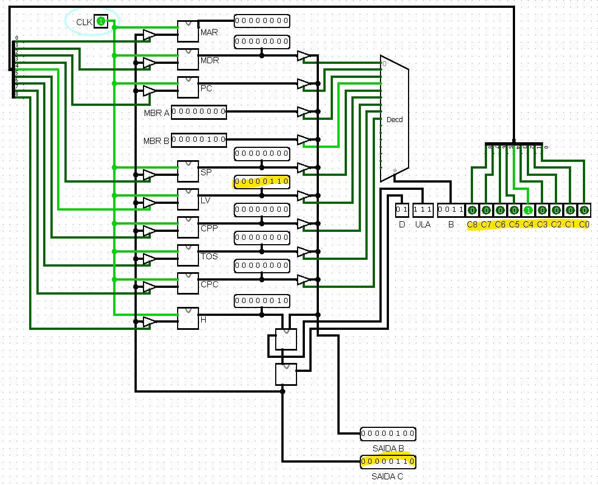

# Circuitos microarquitetura de computadores

Projeto de [microarquitetura](https://en.wikipedia.org/wiki/Microarchitecture) de computadores com CPU de 8bits.

Desenho geral da arquitetura:

# Componentes:

- CLK: Clock
- Linguagem de máquina: Comandos de entrada.
    - D: Define um deslocamento do resultado da CPU.
    - ULA: Define as operações realizadas na ULA.
    B: Define qual registrador terá acesso à ULA.
    C: Define qual registrador de saída irá armazenar o valor de saída da ULA.
- Registradores: Dados de entrada em 8bits.
- Saída B: Valor que está entrando na CPU/ULA.
- Saída C: Valor de saída da CPU.

# CPU de 8 Bits

Visão geral da CPU de 8 bits:

Função:
Valor|Operação
--|--
000|Deixa N1 passar
001|Deixa N2 passar
010|NOT !N1 (inverte bits N1)
011|AND N1 & N2
100|Deslocador de N1
101|OR N1 | N2
110| XOR N1 ^ N2
111|Soma N1 + N2

## Função &

Funcionamento da Função E

## Função XOR

Funcionamento da Função XOR

# Funcionamento

Todas as operações da CPU ocorrem utilizando o registrador `H`.

Realizando soma `MBR A` = `MBR B`
1. Setar valor no registrador `MBR A`
    - Selecionar `0010` nas entradas `B` para habilitar entrada dos dados do `MBR A` na CPU.
    - `ULA`  deve permanecer em `000` (sem operação).
    - Selecionar registrador `H` para receber valor do `MBR A` com `C` = `100000000`.
    - Rodar ciclo de clock.

    
    Imagem: Regitrador H recebeu o valor do `MBR A`

2. Setar valor no registrador `MBR B`
    - Selecionar `0011` nas entradas `B` para habilitar entrada dos dados do `MBR A` na CPU.
    - Setar função de soma com `ULA` igual à `111`.
    - Rodar ciclo de clock.

    
    Imagem: Soma realizada entre os registrados `H` e `MBR B` mostrada na `Saída C`.

3. Salvando valor da Soma.
    Se quisermos salvar o valor da soma em algum registrador, basta selecionar alguma valor nas portas `C`.
    
    Registrador `LV` recebendo valor da soma:
    
